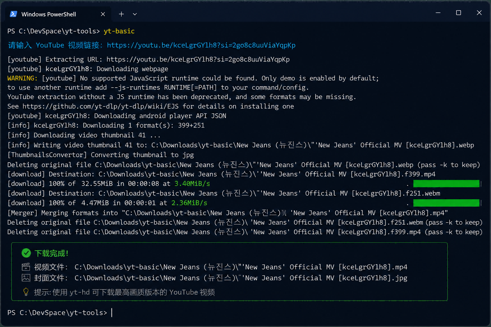

# Terminal YouTube Downloader

> 我的第一个真实可用的 Python 工具项目  
> My first real-world Python utility project.

一个基于 Python、yt-dlp、PowerShell 和 Windows bat 文件实现的命令行 YouTube 下载工具。

A command-line YouTube downloader built with Python, yt-dlp, PowerShell and batch files.

## 项目背景 | Project Background

作为 Python 初学者，我希望开发一个自己每天都能使用的小工具。

目标很简单：

打开终端 → 输入命令 → 粘贴 YouTube 链接 → 完成下载

As a Python beginner, I wanted to build a small tool that I could actually use in daily life.

## Demo

## 功能介绍 | Features

### yt-basic
- 下载 YouTube 视频
- 下载视频封面
- 保存到指定目录
- 最高 1080P

### yt-hd
- 下载 YouTube 视频
- 下载视频封面
- 保存到指定目录
- 下载可提供的最高画质

## 技术栈 | Tech Stack

- Python
- yt-dlp
- PowerShell
- Windows PATH
- Batch Files

## 项目价值 | Project Value

这个项目的重点并不是下载器本身，而是记录一个 Python 初学者如何通过：

需求 → AI辅助开发 → 调试 → 环境配置 → 工具落地

完成第一个真实可用的个人工具项目。
